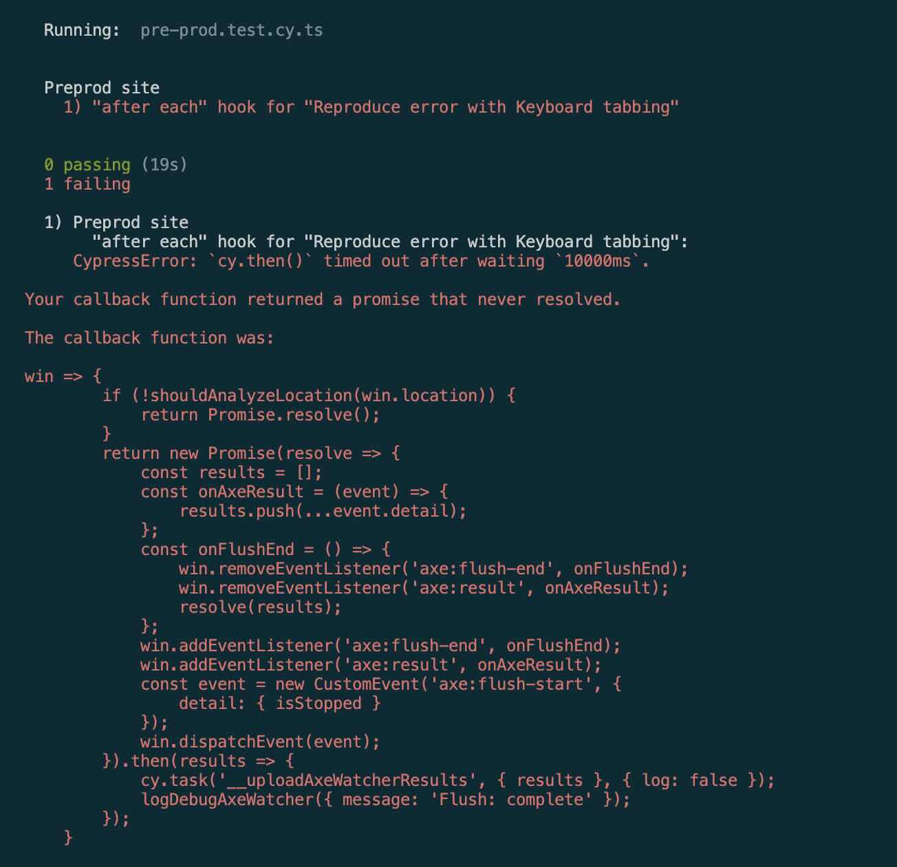

# uol-cypress-axe-watcher
Reproduce Cypress timeout error with Axe Watcher on minimal repo.

# Prerequisite
- Using PNPM package manager

# Per prod authentication
- Manually log into `https://qa-automation.unileveronline.com/`
- Extract the value of cookie `nf_jwt`

# Steps
- Clone report `git clone https://github.com/bennymeade/uol-cypress-axe-watcher.git`
- Install packages command `pnpm install`
- Export API token for `AXE_WATCHER_API_TOKEN`
- Export authentication token for `CYPRESS_JWT_TOKEN`
- Cypress interaction command `pnpm test:cy:open`
- Cypress CI command `pnpm test:cy:run`

